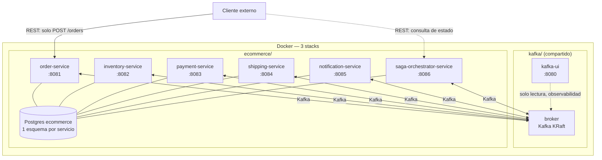
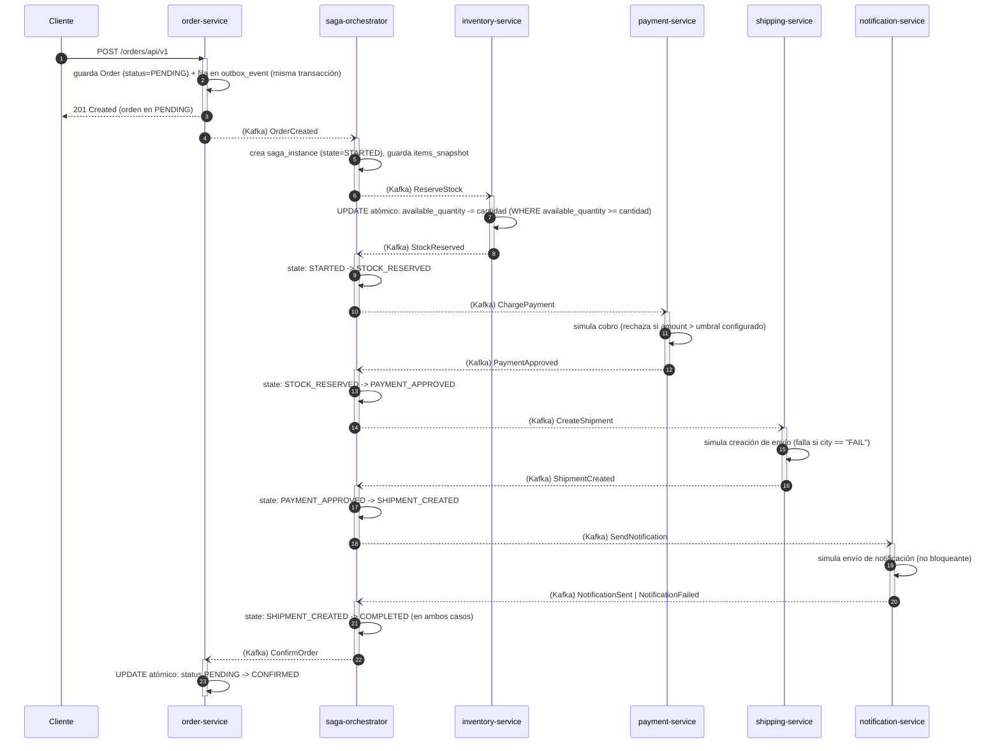
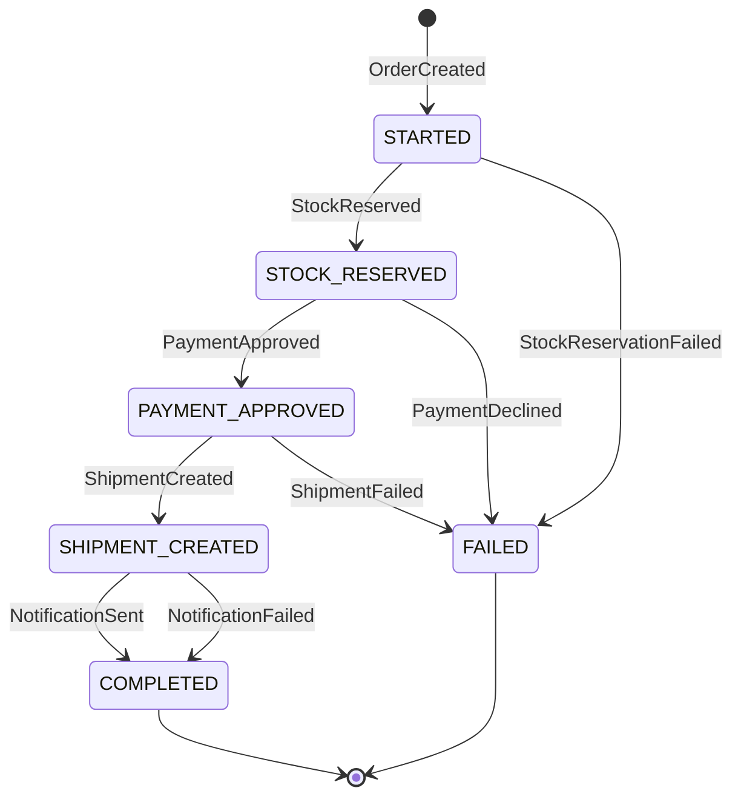
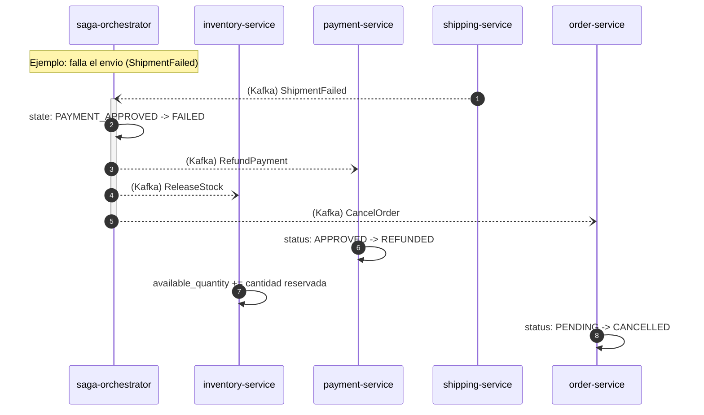
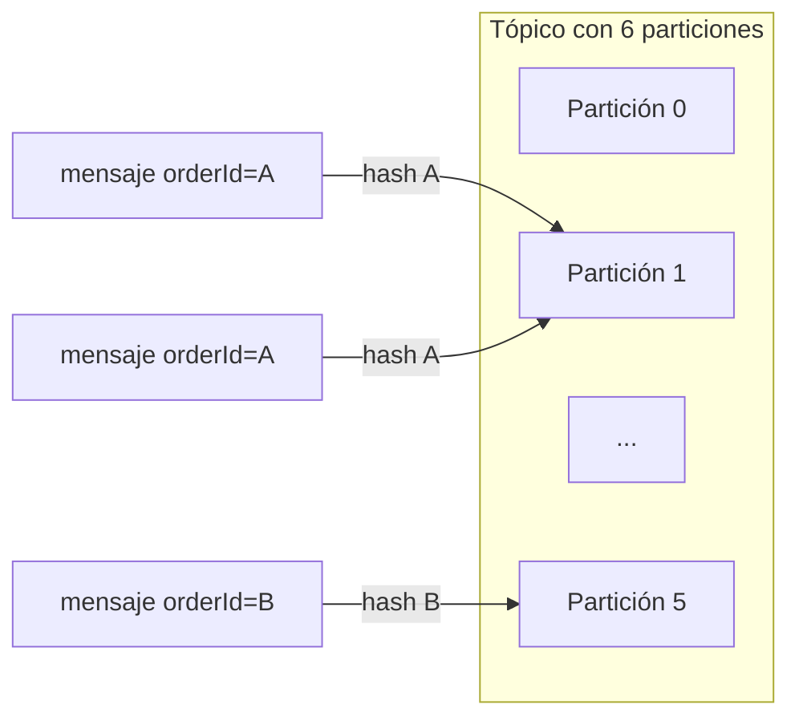
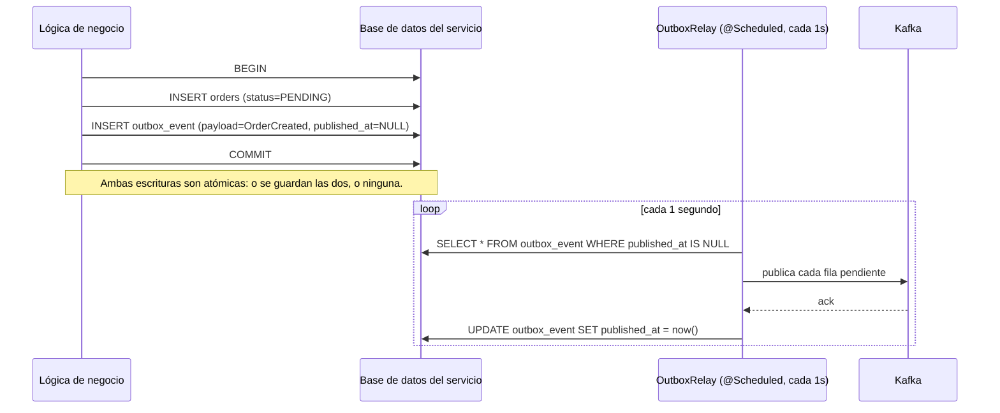
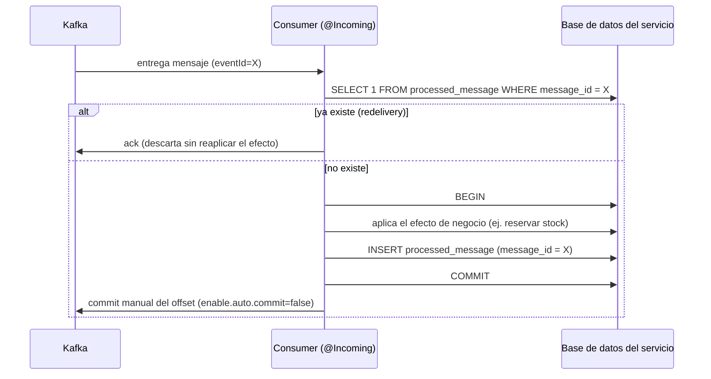
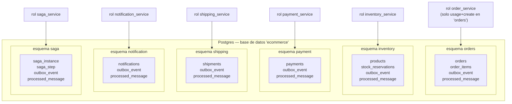

# Arquitectura — Saga de E-commerce (Java/Quarkus + Kafka)

Este documento complementa al [`README.md`](README.md) de este stack: mientras el README explica **cómo correr** cada cosa, este archivo explica **cómo está construido** — el estilo arquitectónico, cómo se relaciona cada microservicio con los demás, el flujo completo de negocio de principio a fin, y el diseño detallado de Kafka que hace posible que 6 servicios independientes se coordinen sin conocerse entre sí.

## 1. Estilo arquitectónico

| Decisión | Qué significa aquí |
|---|---|
| **Microservicios con base de datos propia** | 6 servicios Quarkus independientes, cada uno dueño de su propio esquema de Postgres. Ninguno lee ni escribe directamente en las tablas de otro. |
| **Saga por orquestación** (no coreografía) | Existe un séptimo componente, `saga-orchestrator-service`, que es el **único** que conoce el flujo completo. Los otros 5 no saben que forman parte de una saga — solo saben "me llegó un comando, lo ejecuto, publico si me salió bien o mal". |
| **Comunicación 100% asíncrona vía Kafka** | Ningún microservicio expone ni llama un endpoint REST de otro. La única forma de comunicación entre servicios es publicar/consumir mensajes en tópicos de Kafka. Los endpoints REST de cada servicio son solo para el cliente externo (o para observabilidad, en el caso del orquestador). |
| **Arquitectura hexagonal / DDD por servicio** | Cada servicio se organiza en capas `domain` (modelo puro, sin anotaciones de framework) → `application` (casos de uso) → `infrastructure` (JPA/Panache, Kafka, REST) → `shared` (manejo de errores transversal). El dominio no depende de Quarkus ni de Kafka; es al revés. |
| **Transactional Outbox + Inbox idempotente** | Ver sección 6. Es lo que hace que la mensajería sea confiable a pesar de que Kafka solo garantiza "al menos una vez". |
| **Stack reactivo** | Quarkus 3.36.1 + Java 21 + Mutiny + Hibernate Reactive Panache + SmallRye Reactive Messaging. Ningún hilo se bloquea esperando I/O (ni la base de datos, ni Kafka). |

### Diagrama de despliegue

**Lectura clave del diagrama:** el cliente solo le habla por REST a `order-service` (para crear la orden) y opcionalmente a `saga-orchestrator-service` (para consultar el estado o forzar un reintento). Todos los demás servicios son invisibles para el cliente — su única puerta de entrada/salida es Kafka. La base de datos es un único contenedor Postgres compartido físicamente, pero lógicamente aislado por esquema y por rol (ver sección 7).

## 2. Los 6 microservicios y cómo se relacionan entre sí

| Servicio | Bounded context | Esquema BD | Ruta REST | A quién le manda comandos (Kafka) | Quién le manda comandos a él |
|---|---|---|---|---|---|
| `order-service` | El agregado Order | `orders` | `/orders/api/v1` | *(nadie — es el origen de la saga)* | `saga-orchestrator-service` (`ConfirmOrder`/`CancelOrder`) |
| `inventory-service` | Catálogo + stock | `inventory` | `/inventory/api/v1` | *(nadie, solo responde)* | `saga-orchestrator-service` (`ReserveStock`/`ReleaseStock`) |
| `payment-service` | Cobros/reembolsos | `payment` | `/payments/api/v1` | *(nadie, solo responde)* | `saga-orchestrator-service` (`ChargePayment`/`RefundPayment`) |
| `shipping-service` | Envíos | `shipping` | `/shipping/api/v1` | *(nadie, solo responde)* | `saga-orchestrator-service` (`CreateShipment`/`CancelShipment`) |
| `notification-service` | Notificaciones al cliente | `notification` | `/notifications/api/v1` | *(nadie, solo responde)* | `saga-orchestrator-service` (`SendNotification`) |
| `saga-orchestrator-service` | La saga completa | `saga` | `/sagas/api/v1` | Los 5 servicios de arriba | `order-service` (evento `OrderCreated`, el disparador inicial) |

**Por qué la relación tiene forma de estrella y no de cadena:** los 5 servicios de dominio (order, inventory, payment, shipping, notification) **no se conocen entre sí** — ninguno le manda un mensaje directamente a otro. Todos hablan únicamente con `saga-orchestrator-service`, que actúa como el único nodo central que decide el orden de ejecución. Esto es deliberado: si `payment-service` tuviera que saber que después de él viene `shipping-service`, cualquier cambio en el flujo de negocio (agregar un paso, reordenar dos pasos) obligaría a tocar el código de varios servicios a la vez. Con la orquestación centralizada, ese conocimiento vive en un solo lugar: `SagaOrchestratorService.java`.

**Independencia real, no solo de código:** los 6 proyectos Maven no comparten ni una sola librería propia (ni siquiera un "common" con los DTOs de los eventos) — cada servicio define sus propios records de mensaje Kafka en su paquete `application/event`, aunque el *shape* del JSON coincida con el que espera el orquestador. Esto es a propósito: evita que un cambio en una librería compartida obligue a redesplegar los 6 servicios a la vez, al costo de una pequeña duplicación de definiciones de mensaje entre el servicio que las produce y el orquestador que las consume.

## 3. Flujo completo del proceso de e-commerce (camino feliz)

**Puntos importantes de este flujo:**

1. **El cliente nunca espera a la saga completa.** El `POST /orders` devuelve `201` en cuanto la orden queda guardada como `PENDING` — todo lo que sigue (reservar stock, cobrar, enviar, notificar) ocurre después, de forma asíncrona. Para saber si la saga terminó, el cliente hace polling a `GET /sagas/api/v1/{orderId}` (o consulta cada servicio individualmente).
2. **Cada flecha `--)` (Kafka) implica, por debajo, el patrón outbox → relay → broker → inbox → efecto**, no una llamada directa (ver sección 6). Ese detalle se omite en este diagrama para que se lea el flujo de negocio sin ruido técnico.
3. **`saga-orchestrator-service` es el único punto de decisión.** Cada vez que recibe un evento, aplica una transición de estado (validada de forma atómica en SQL, ver sección 4) y decide el siguiente comando a emitir — o, si el evento indica un fallo, decide qué compensaciones emitir (sección 5).
4. **`NotificationSent` y `NotificationFailed` llevan al mismo lugar** (`COMPLETED`): es la única rama del diseño donde un fallo no dispara ninguna compensación, porque en ese punto el pedido ya está pagado y despachado — no hay nada que deshacer solo porque el correo de confirmación no llegó.

## 4. Máquina de estados de la saga

`FAILED` y `COMPLETED` son estados terminales. La validación de qué transición es válida **no vive en una clase de dominio separada** (se eliminó `SagaStateMachine.java` de este proyecto por ser código muerto) — se aplica directamente como un `UPDATE saga_instance SET state = ? WHERE id = ? AND state IN (...)` atómico en `SagaInstanceRepository.updateState(...)`. Si dos eventos llegan "casi a la vez" (por ejemplo, una redelivery duplicada de Kafka), la segunda actualización simplemente no afecta ninguna fila — es un *no-op* seguro, sin necesidad de locks explícitos.

## 5. Caminos de compensación (qué pasa cuando algo falla)

No existe un `ROLLBACK` automático entre 6 bases de datos distintas. Cuando un paso falla, el orquestador **emite explícitamente los comandos que deshacen** lo que ya se completó con éxito en pasos anteriores:

| Falla en... | Compensaciones que emite el orquestador | Por qué |
|---|---|---|
| `StockReservationFailed` | `CancelOrder` | Es el primer paso: no se llegó a cobrar ni reservar nada más, así que no hay nada más que deshacer. |
| `PaymentDeclined` | `ReleaseStock` + `CancelOrder` | El stock ya se había reservado — hay que devolverlo al inventario disponible. |
| `ShipmentFailed` | `RefundPayment` + `ReleaseStock` + `CancelOrder` | Ya se había cobrado y reservado stock — hay que deshacer ambas cosas, además de cancelar la orden. |
| `NotificationFailed` | **Ninguna.** | La orden ya está pagada y despachada; la saga llega a `COMPLETED` igual (ver punto 4 de la sección 3). |

Las tres compensaciones de una misma falla (por ejemplo, `RefundPayment` + `ReleaseStock` + `CancelOrder`) **son independientes entre sí** — no importa en qué orden las procese cada servicio destino, ni si se procesan en paralelo, porque cada una toca una base de datos distinta y ninguna depende del resultado de la otra.

**Disparadores deterministas para reproducir cada camino sin mocks manuales:**
- **Stock insuficiente** → pedir más unidades que `availableQuantity` del producto.
- **Pago rechazado** → que el total de la orden supere `PAYMENT_DECLINE_THRESHOLD` (por defecto 5000).
- **Envío fallido** → que `shippingAddress.city` sea exactamente `"FAIL"` (sin distinguir mayúsculas/minúsculas).
- **Notificación fallida** (no bloqueante) → que `customerId` sea `"fail"` (el destinatario simulado se arma como `<customerId>@example.com`).

## 6. Flujo detallado de Kafka

### 6.1 Convención de tópicos

`ecommerce.<dominio>.<events|commands>.v1`, más un `.dlq` (dead-letter queue) por cada tópico con consumidor real. 21 tópicos en total, creados al arrancar el stack por un job `ecommerce-topic-init` (contenedor de un solo uso, reutiliza la imagen `../kafka/topic-init` sin duplicar el Dockerfile).

| Tópico | Particiones | Productor | Consumidor (`group.id`) |
|---|---|---|---|
| `ecommerce.order.events.v1` (+ `.dlq`) | 6 (3) | order-service | saga-orchestrator |
| `ecommerce.order.commands.v1` (+ `.dlq`) | 6 (3) | saga-orchestrator | order-service |
| `ecommerce.inventory.commands.v1` (+ `.dlq`) | 6 (3) | saga-orchestrator | inventory-service |
| `ecommerce.inventory.events.v1` (+ `.dlq`) | 6 (3) | inventory-service | saga-orchestrator |
| `ecommerce.payment.commands.v1` (+ `.dlq`) | 6 (3) | saga-orchestrator | payment-service |
| `ecommerce.payment.events.v1` (+ `.dlq`) | 6 (3) | payment-service | saga-orchestrator |
| `ecommerce.shipping.commands.v1` (+ `.dlq`) | 6 (3) | saga-orchestrator | shipping-service |
| `ecommerce.shipping.events.v1` (+ `.dlq`) | 6 (3) | shipping-service | saga-orchestrator |
| `ecommerce.notification.commands.v1` (+ `.dlq`) | 6 (3) | saga-orchestrator | notification-service |
| `ecommerce.notification.events.v1` (+ `.dlq`) | 6 (3) | notification-service | saga-orchestrator |
| `ecommerce.saga.events.v1` | 3 | saga-orchestrator | *(auditoría, sin consumidor obligatorio)* |

`saga-orchestrator-service` es el único servicio que produce hacia **6 tópicos distintos** y consume de **5 tópicos distintos** — su relay del outbox (`SagaCommandRelay.java`) enruta cada mensaje pendiente según la columna `outbox_event.topic` de esa fila. Los otros 5 servicios solo tienen un tópico de entrada (comandos) y uno de salida (eventos) cada uno.

### 6.2 Orden garantizado: `orderId` como key

Kafka garantiza orden **dentro de una misma partición**, pero un tópico con 6 particiones normalmente procesaría mensajes en paralelo sin ningún orden global. La solución: **todo mensaje usa el `orderId` como key**. Kafka siempre enruta mensajes con la misma key a la misma partición, así que todos los eventos y comandos de una orden en particular quedan en la misma partición y se procesan siempre en el orden en que se publicaron — sin importar cuántas particiones tenga el tópico ni cuántas instancias del mismo consumidor corran en paralelo.

### 6.3 Outbox transaccional (cómo se publica de forma confiable)

Esto resuelve el problema clásico de "guardé en la base de datos pero me caí antes de publicar en Kafka" (o al revés): la escritura de negocio y la fila del outbox ocurren en la **misma transacción SQL** (`@WithTransaction`), así que nunca queda una sin la otra. El `OutboxRelay` (`@Scheduled(every = "1s")`) es el único que efectivamente habla con Kafka; si Kafka está caído, las filas simplemente se acumulan como pendientes y se publican en cuanto el broker vuelve.

### 6.4 Inbox idempotente (cómo se consume sin duplicar efectos)

Como Kafka solo garantiza entrega "al menos una vez" (*at-least-once*), un mismo mensaje puede llegar duplicado (por ejemplo, si el consumidor se cayó justo después de aplicar el efecto pero antes de confirmar el offset). El inbox evita que ese duplicado se aplique dos veces: el `eventId` del mensaje es la clave primaria de `processed_message`, y su inserción ocurre en la misma transacción que el efecto de negocio. Combinando outbox (en el productor) + inbox (en el consumidor), toda la cadena se comporta como si fuera *effectively-once*, aunque cada pieza individual de Kafka solo garantice *at-least-once*.

### 6.5 Qué pasa si un consumidor no logra procesar un mensaje: Dead Letter Queue

Cada tópico con consumidor real tiene configurado `failure-strategy=dead-letter-queue`: si el procesamiento de un mensaje lanza una excepción de forma repetida, en vez de bloquear indefinidamente esa partición (y con ella, todos los mensajes de las demás órdenes que caigan en la misma partición), el mensaje se mueve a `<tópico>.dlq` y el consumidor sigue avanzando con el resto. Es el mecanismo de contención de fallos: un mensaje "envenenado" (payload corrupto, bug de deserialización) no puede tumbar todo el pipeline de una saga.

### 6.6 Configuración de confiabilidad (resumen)

| Lado | Configuración | Por qué |
|---|---|---|
| Productor | `enable.idempotence=true` | Evita que un reintento de red (por ejemplo, un timeout de ack) duplique el mensaje en el tópico. |
| Productor | `acks=all` | El productor no considera el mensaje enviado hasta que el broker confirma que lo escribió de forma durable. |
| Consumidor | `enable.auto.commit=false` | El offset solo se confirma después de que el efecto de negocio ya quedó aplicado y persistido — nunca antes. |
| Consumidor | `auto.offset.reset=earliest` | Si el consumidor arranca por primera vez (sin offset previo), procesa desde el principio del tópico en vez de perderse mensajes ya publicados. |
| Consumidor | `failure-strategy=dead-letter-queue` | Ver 6.5. |
| Todos los mensajes | `key = orderId` | Ver 6.2 — garantiza orden por orden de compra. |

## 7. Base de datos

Un solo contenedor Postgres (`ecommerce/db`), con **una sola base de datos** (`ecommerce`) y **un esquema por servicio** — no son 6 bases de datos separadas:

**El aislamiento no viene de tener 6 bases físicas, sino de los permisos de Postgres:** cada servicio se conecta con su propio rol, y ese rol **no tiene ningún permiso fuera de su propio esquema** (`GRANT usage, create ON SCHEMA <x> TO <rol>`, nada más) — el rol de `payment_service` literalmente no puede ver ni las tablas de `orders` ni las de ningún otro esquema. Cada rol además tiene su `search_path` fijado del lado del servidor (`ALTER ROLE ... SET search_path = <esquema>`), así que el SQL de cada servicio no necesita calificar sus tablas con el nombre del esquema.

El SQL de cada servicio vive versionado en `src/main/resources/db/migration/V1__init.sql` y se aplica automáticamente vía Flyway al arrancar cada servicio — no hay ningún script manual que correr.

## 8. Observabilidad y operación

| Qué | Dónde |
|---|---|
| Swagger UI de cada servicio | `http://localhost:<puerto>/<root-path>/q/swagger-ui/` (ver tabla de puertos en el README) |
| OpenAPI JSON | `http://localhost:<puerto>/<root-path>/q/openapi` |
| Health check | `http://localhost:<puerto>/<root-path>/q/health/ready` (incluye el estado del pool de conexiones y de los canales de Kafka) |
| Estado + línea de tiempo de una saga | `GET http://localhost:8086/sagas/api/v1/{orderId}` |
| Reintentar el último comando de una saga atascada | `POST http://localhost:8086/sagas/api/v1/{orderId}/retry` |
| Inspeccionar tópicos/mensajes/consumer groups de Kafka | Kafka UI, `http://localhost:8080` |

El endpoint `/retry` vuelve a publicar el último comando enviado **con el mismo `eventId` original** — así el inbox del servicio destino decide si es un reintento genuino (el mensaje se perdió) o si no hace falta nada (el comando ya se había aplicado, solo se perdió la respuesta).

## 9. Fuera de alcance, a propósito

- **Sin OIDC/Keycloak** — no hay una instancia de Keycloak corriendo en este entorno Docker; el punto de extensión (`quarkus-oidc` + `@Authenticated`) queda identificado para cuando exista un realm disponible.
- **Sin manifiestos de Kubernetes** — el objetivo de despliegue es Docker Compose.
- **Sin integraciones reales de pago/envío/notificación** — las tres son simulaciones deterministas (sección 5), precisamente para poder reproducir cualquier camino de compensación sin depender de proveedores externos.

