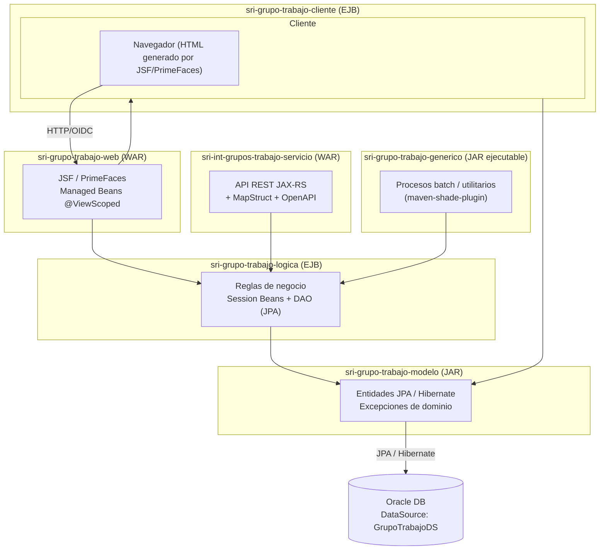

# Arquitectura del proyecto — sri-grupo-trabajo-jakarta

## Resumen ejecutivo

Aplicación **Jakarta EE monolítica multi-módulo (Maven)** para el SRI (Servicio de Rentas Internas de Ecuador), desplegada sobre **JBoss/WildFly EAP 8**. La capa web **es Java puro + JSF (Jakarta Faces) con PrimeFaces** como framework de componentes UI — no usa React/Angular/Vue ni ningún framework JS de frontend moderno. Es arquitectura en capas clásica de Java EE (Web → Cliente → Lógica/EJB → Modelo/JPA → Base de datos Oracle), con un módulo adicional expuesto como servicio REST (API JAX-RS).

## Arquitectura general

Estilo: **N-capas (layered) dentro de un mismo dominio de despliegue**, repartidas en módulos Maven independientes que se ensamblan como EAR-like (WAR + EJB-JAR + JARs) sobre el mismo servidor de aplicaciones.

## Módulos Maven

| Módulo | Packaging | Responsabilidad |
|---|---|---|
| `sri-grupo-trabajo-modelo` | `jar` | Entidades JPA/Hibernate, vistas, enumeraciones y excepciones de dominio |
| `sri-grupo-trabajo-logica` | `ejb` | Lógica de negocio (Session Beans), DAOs, DTOs (`*To`), persistencia (`persistence.xml`) |
| `sri-grupo-trabajo-cliente` | `ejb` | Integración con otros sistemas vía RMI, REST y SOAP |
| `sri-grupo-trabajo-web` | `war` | **Presentación web JSF/PrimeFaces**, controladores (Managed Beans), plantillas, páginas `.xhtml` |
| `sri-grupo-trabajo-generico` | `jar` (uber-jar con `maven-shade-plugin`) | Procesos genéricos/batch, ensamblado como jar ejecutable con dependencias sombreadas |
| `sri-int-grupos-trabajo-servicio` | `war` | **API REST** (JAX-RS + MicroProfile OpenAPI + MapStruct) para integración externa |

Todos heredan del POM padre (`pom.xml` raíz, `packaging=pom`), que centraliza versiones, plugins y el `dependencyManagement`.

## Stack tecnológico

### Backend / plataforma
- **Java 21** (`maven.compiler.source/target=21`)
- **Jakarta EE 10** (`jakarta.jakartaee-api` 10.0.0)
- **Servidor de aplicaciones:** JBoss / WildFly **EAP 8** (`jboss-deployment-structure.xml`, `jboss-web.xml`, `JBOSS_VERSION: 8` en CI/CD)
- **EJB 4.0** (Session Beans) para la capa de lógica y cliente
- **JPA / Hibernate 6.2.18.Final** como proveedor de persistencia, dialecto Oracle (`OracleDialect`)
- **Base de datos:** Oracle, vía datasource JNDI `java:/GrupoTrabajoDS`
- **JAX-RS (RESTEasy)** para servicios REST, `resteasy-core` / `resteasy-jaxrs`
- **MapStruct 1.5.5** (mapeo DTO↔entidad, componente CDI) en el módulo de servicio REST
- **MicroProfile OpenAPI** para documentación de la API REST
- **Seguridad:** OIDC (`OidcConfigurationServletListener`, Wildfly Elytron `wildfly-elytron-http-oidc`), autenticación tipo `auth-method=OIDC` (antes Keycloak, código comentado en `web.xml`), más un filtro propio `FiltroAutorizacion` (librería interna `sri-seguridad-intranet`)
- **JBoss Logging** para logging

### Frontend / capa web
- **JSF (Jakarta Faces) puro Java** — no hay SPA ni framework JS moderno.
- **PrimeFaces 14.0.9** (classifier `jakarta`) como suite de componentes UI, tema propio `sri-barcelona-theme` (librería interna).
- Páginas `.xhtml` (Facelets) con plantillas (`base.xhtml`, `menu.xhtml`, `topbar.xhtml`, `footer.xhtml`) y componentes composite (`dialogConfirmacion.xhtml`, etc.).
- **CSS/SASS** propio (`resources/sass`, `theme.scss` compilado a `theme.css`) + PrimeFaces Font Awesome.
- JavaScript mínimo/utilitario (`resources/js/base.js`) — sin bundlers (Webpack/Vite) ni frameworks (React/Angular/Vue).
- Minificación de recursos web vía `yuicompressor-maven-plugin` (compresión JS/CSS en build, no un pipeline de frontend moderno).
- Manejo de excepciones JSF centralizado (`ManejadorGlobalExcepcion`, `ExceptionHandlerFactory`).
- Internacionalización básica: `messages_es.properties`, locale `es_EC`.

### Librerías internas SRI (reutilizadas como dependencias Maven)
- `sri-seguridad-intranet` (seguridad/autorización)
- `sri-gestion-documentacion-util`
- `sri-adm-menu-generico`, `sri-adm-catalogo-generico` (menús y catálogos administrativos)
- `sri-talento-humano-generico`
- `sri-pista-auditoria` (auditoría)
- `sri-archivos`
- `sri-barcelona-theme` (tema visual corporativo sobre PrimeFaces)

### Testing
- JUnit 5 (Jupiter), Mockito, HSQLDB (BD en memoria para pruebas de persistencia), Jacoco (cobertura, mínimo 85% líneas / 75% ramas configurado)

### CI/CD y calidad
- **GitLab CI** (`.gitlab-ci.yml`), pipeline con etapas Construir → Pruebas → Despliegue, plantillas compartidas del área QA
- **SonarQube** integrado para análisis estático
- Build con **Maven** (JDK 21), despliegue a instancias JBoss EAP 8 diferenciadas por ambiente (test/pre) y por cada módulo (web, cliente, lógica, modelo, genérico, servicio REST)
- Repositorio de artefactos Maven propio (Nexus interno, `sridesa02:8081`)

## Respuesta directa a tu pregunta

**La parte web usa JSF (Jakarta Faces) + PrimeFaces**, es decir, **Java puro del lado del servidor renderizando HTML** (Facelets `.xhtml`), no un framework JavaScript de frontend. PrimeFaces provee los componentes visuales (tablas, diálogos, formularios, tema "Barcelona" personalizado por el SRI), y toda la lógica de presentación vive en **Managed Beans Java anotados `@ViewScoped`** (paquete `web.controlador`), no en un cliente SPA separado.
